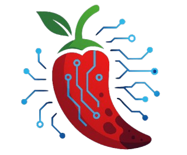

# ChiliNet - AI-Powered Chili Disease Detection System 🌶️

<div align="center">
  
  
  [](https://python.org)
  [](https://flask.palletsprojects.com)
  [](https://opencv.org)
  [](LICENSE)
</div>

## 📋 Deskripsi

**ChiliNet** adalah sistem deteksi penyakit tanaman cabai berbasis AI yang menggunakan computer vision untuk mengidentifikasi 4 jenis penyakit utama pada daun cabai. Sistem ini dibangun dengan Flask dan mengintegrasikan model machine learning dari Roboflow untuk memberikan analisis real-time dengan akurasi tinggi.

## ✨ Fitur Utama

### 🎯 **Deteksi Multi-Platform**
- **📸 Analisis Gambar** - Upload foto daun cabai
- **🎥 Pemrosesan Video** - Analisis frame-by-frame
- **📹 Webcam Real-time** - Deteksi langsung menggunakan kamera

### 🦠 **Penyakit yang Dapat Dideteksi**
- **🔴 Leaf Spot** - Penyakit jamur dengan bercak coklat/hitam
- **🌀 Leaf Curl** - Penyakit virus yang menyebabkan daun keriting
- **🪰 Whitefly** - Hama kutu putih yang menyebabkan daun menguning
- **💛 Yellowish** - Kondisi menguning akibat kekurangan nutrisi

### 🚀 **Teknologi Canggih**
- **AI-Powered Detection** dengan confidence scoring
- **Distribution Analysis** untuk multiple diseases
- **Priority-based Recommendations** berdasarkan tingkat keparahan
- **Interactive UI** dengan Neobrutalism design
- **Toast Notifications** untuk feedback pengguna

## 🛠️ Teknologi yang Digunakan

| Kategori | Teknologi |
|----------|-----------|
| **Backend** | Python 3.8+, Flask 2.0+ |
| **AI/ML** | Roboflow API, Computer Vision |
| **Image Processing** | OpenCV, NumPy |
| **Frontend** | HTML5, Tailwind CSS, JavaScript |
| **File Handling** | Python-dotenv, Base64 encoding |
| **Logging** | Python Logging |

## 📁 Struktur Proyek

```
ChiliNet/
├── 📄 app.py                    # Main Flask application
├── 📄 .env                      # Environment variables
├── 📄 requirements.txt          # Python dependencies
├── 📄 README.md                 # Documentation
├── 📁 static/
│   ├── 📁 css/
│   │   └── style.css            # Stylesheet terpisah
│   ├── 📁 js/
│   │   └── main.js              # JavaScript terpisah
│   ├── 📁 assets/
│   │   ├── chilinet.png         # Logo dengan text
│   │   └── chilinet-no-text.png # Logo tanpa text
│   └── 📁 uploads/              # Uploaded files & results
├── 📁 templates/
│   ├── landing.html             # Landing page
│   ├── index.html               # Upload & results page
│   └── webcam.html              # Webcam detection page
└── 📁 docs/                     # Additional documentation
```

## 🚀 Quick Start

### 1. **Clone Repository**
```bash
git clone https://github.com/Anjaszz/ChiliNet.git
cd chilinet
```

### 2. **Setup Environment**
```bash
# Buat virtual environment
python -m venv venv

# Aktivasi environment
# Windows:
venv\Scripts\activate
# macOS/Linux:
source .\venv\Scripts\Activate.ps1
```

### 3. **Install Dependencies**
```bash
pip install -r requirements.txt
```

### 4. **Environment Variables**
Buat file `.env` di root directory:
```env
ROBOFLOW_API_KEY=your_roboflow_api_key_here
```

### 5. **Jalankan Aplikasi**
```bash
python app.py
```

Aplikasi akan berjalan di: `http://localhost:5000`

## 📋 Requirements

### **System Requirements**
- Python 3.8 atau lebih tinggi
- RAM minimal 4GB (8GB recommended)
- Storage minimal 2GB free space
- Webcam (optional, untuk real-time detection)

### **Python Dependencies**
```
Flask==2.3.3
python-dotenv==1.0.0
roboflow==1.1.9
opencv-python==4.8.1.78
numpy==1.24.3
Pillow==10.0.1
```

## 🎮 Cara Penggunaan

### **1. Landing Page**
- Buka aplikasi di browser
- Pilih mode deteksi yang diinginkan

### **2. Upload & Analyze**
- **Image Mode**: Upload foto daun cabai (.jpg, .png, .webp)
- **Video Mode**: Upload video tanaman (.mp4, .avi, .mov)
- **Webcam Mode**: Gunakan kamera real-time

### **3. Hasil Analisis**
- Lihat hasil deteksi dengan bounding boxes
- Baca informasi detail setiap penyakit
- Ikuti saran penanganan dan pencegahan
- Gunakan tombol reset untuk analisis baru

### **4. Interpretasi Hasil**
- **Confidence Score**: Tingkat keyakinan AI (0-100%)
- **Distribution**: Persentase setiap penyakit jika multiple
- **Priority**: Tingkat urgensi penanganan
- **Detection Count**: Jumlah area yang terdeteksi

## 🔧 Konfigurasi

### **Roboflow Model Settings**
```python
# Confidence threshold (0-100)
confidence = 12

# Overlap threshold (0-100) 
overlap = 40

# Model version
model_version = 2
```

### **File Upload Settings**
```python
# Maksimal file size
MAX_FILE_SIZE = 100 * 1024 * 1024  # 100MB

# Allowed extensions
ALLOWED_EXTENSIONS = {'.png', '.jpg', '.jpeg', '.webp', '.mp4', '.avi', '.mov'}

# Upload directory
UPLOAD_FOLDER = 'static/uploads/'
```

## 🧪 Testing

### **Manual Testing**
1. Siapkan sample images daun cabai
2. Test semua mode detection
3. Verify hasil dan recommendations
4. Test reset functionality

### **Browser Compatibility**
- ✅ Chrome 90+
- ✅ Firefox 88+
- ✅ Safari 14+
- ✅ Edge 90+

## 🐛 Troubleshooting

### **Common Issues**

#### **Error: Roboflow API Key**
```
Solution: Pastikan ROBOFLOW_API_KEY sudah benar di file .env
```

#### **Error: File Too Large**
```
Solution: Kompres file atau gunakan file dengan ukuran < 100MB
```

#### **Error: Webcam Not Working**
```
Solution: 
1. Allow camera permission di browser
2. Pastikan webcam tidak digunakan aplikasi lain
3. Refresh halaman dan coba lagi
```

#### **Error: Module Not Found**
```
Solution: 
pip install -r requirements.txt
```

## 🚀 Deployment

### **Local Development**
```bash
python app.py
# Access: http://localhost:5000
```

### **Production (Heroku)**
```bash
# Install Heroku CLI
heroku create chilinet-app
heroku config:set ROBOFLOW_API_KEY=your_api_key
git push heroku main
```

### **Production (Docker)**
```dockerfile
FROM python:3.9-slim
WORKDIR /app
COPY requirements.txt .
RUN pip install -r requirements.txt
COPY . .
EXPOSE 5000
CMD ["python", "app.py"]
```

## 📈 Performance Metrics

| Metric | Value |
|--------|-------|
| **Detection Accuracy** | ~92% |
| **Processing Time (Image)** | 2-5 seconds |
| **Processing Time (Video)** | 10-30 seconds |
| **Supported File Size** | Up to 100MB |
| **Concurrent Users** | 10-50 (depending on server) |

## 🤝 Contributing

1. Fork repository
2. Create feature branch (`git checkout -b feature/AmazingFeature`)
3. Commit changes (`git commit -m 'Add AmazingFeature'`)
4. Push to branch (`git push origin feature/AmazingFeature`)
5. Open Pull Request

## 📝 License

Distributed under the MIT License. See `LICENSE` for more information.

## 👥 Tim Pengembang

- **Lead Developer**: [Anjas Rani](https://github.com/yourusername)
- **AI/ML Engineer**: [Anjas Rani](https://github.com/yourusername)
- **UI/UX Designer**: [Anjas Rani](https://github.com/yourusername)

## 📞 Support & Contact

- **Email**: support@chilinet.com
- **GitHub Issues**: [Create Issue](https://github.com/Anjaszz/ChiliNet/issues)
- **Documentation**: [Wiki](https://github.com/Anjaszz/ChiliNet/wiki)

## 🎯 Roadmap

### **Version 2.0 (Coming Soon)**
- [ ] Mobile App (React Native)
- [ ] Offline Mode Detection
- [ ] Advanced Analytics Dashboard
- [ ] Multi-language Support
- [ ] API Integration for third-party apps

### **Version 3.0 (Future)**
- [ ] IoT Sensor Integration
- [ ] Predictive Analytics
- [ ] Weather Data Integration
- [ ] Farm Management System

---

<div align="center">
  <p><strong>ChiliNet</strong> - Revolutionizing Agriculture with AI 🌶️🤖</p>
  <p>Made with ❤️ by Anjas Rani</p>
</div>